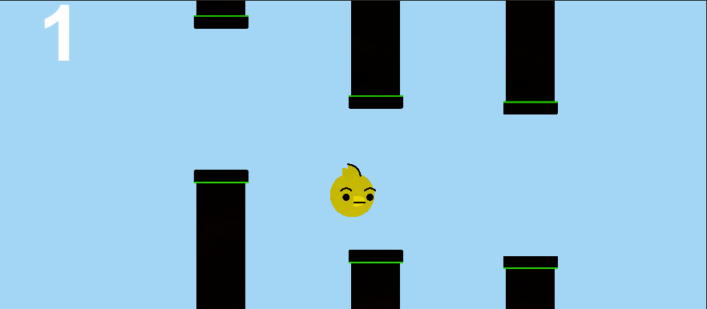
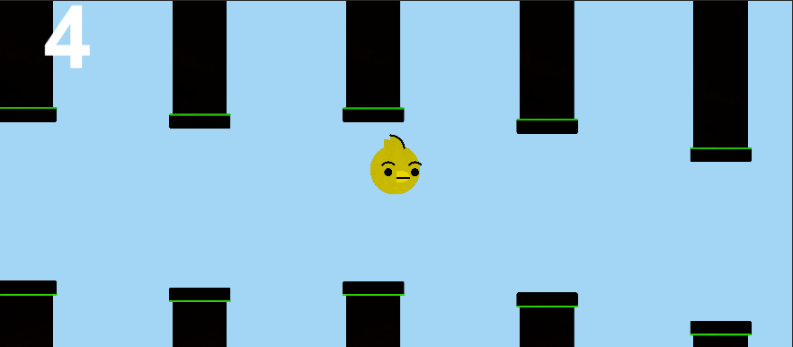
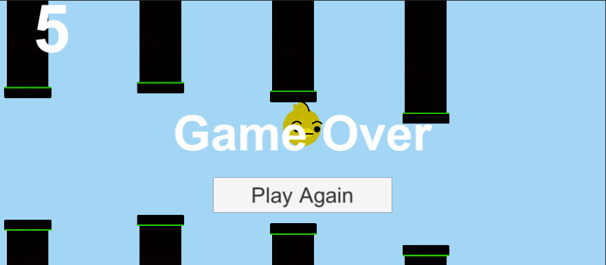

# FBirdUnity2DGame

This is a Simple Flapy Bird Game in Unity with C# code.

This includes some basic concepts of unity like:
Prefabs, how to write C# scripts and expose their varables in unity environemnt,
updating the game logic with Time, and colision logics.

If the Bird can fly throgh the pipes without hiting them, score point will increase.

If the Bird hits the pipes, we should start again.

This is just the Begining and It could be improved in the future:

